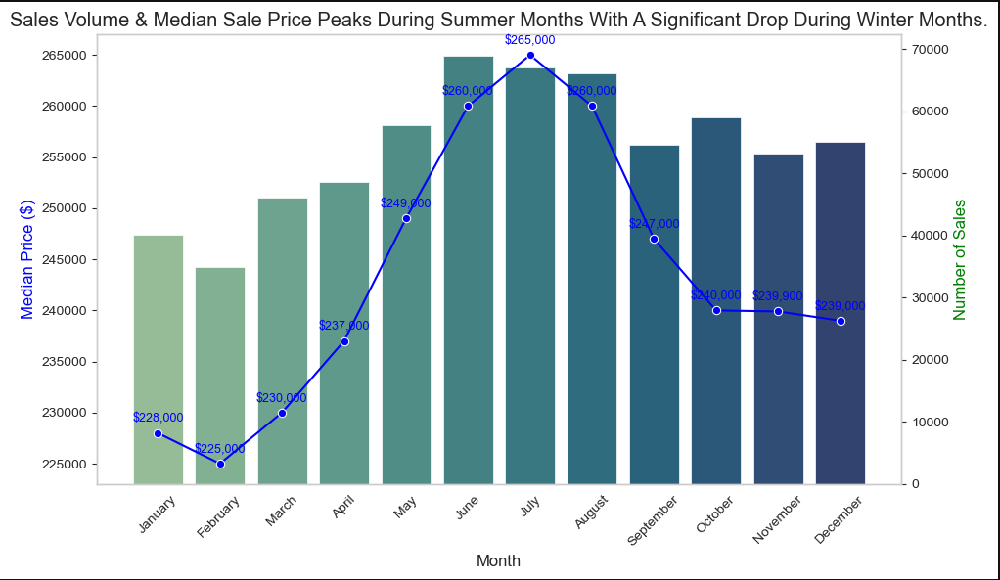
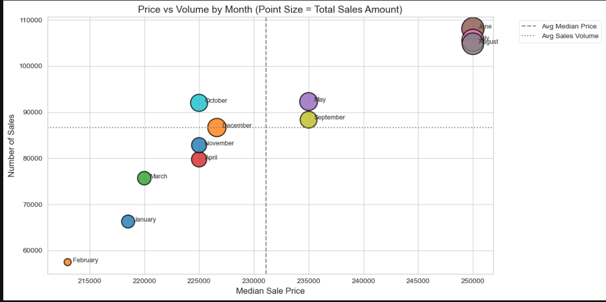
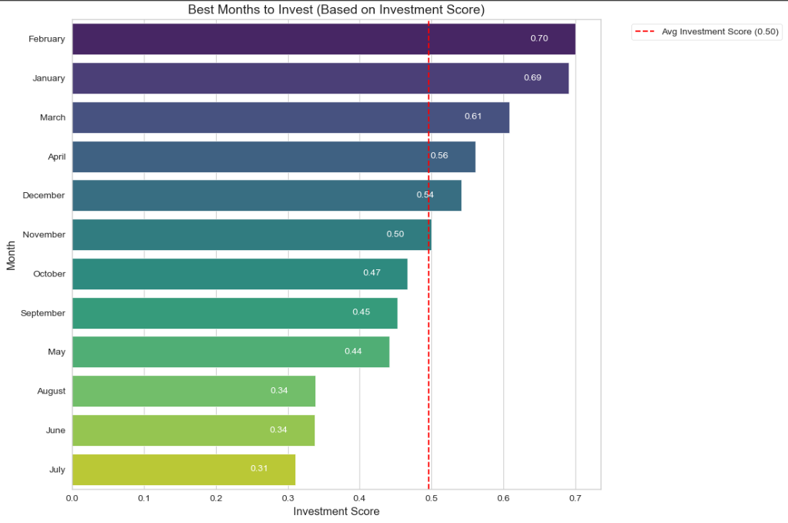
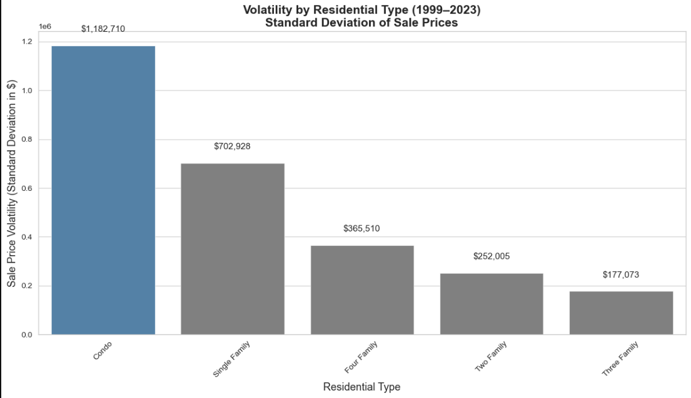
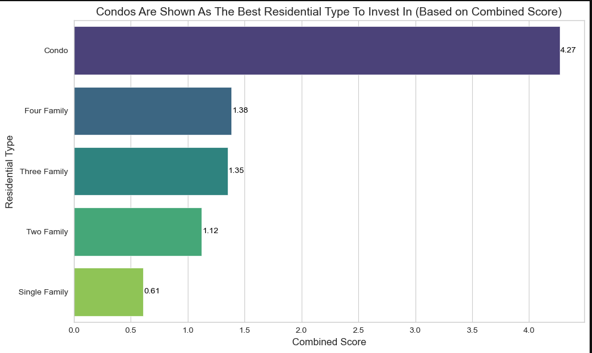
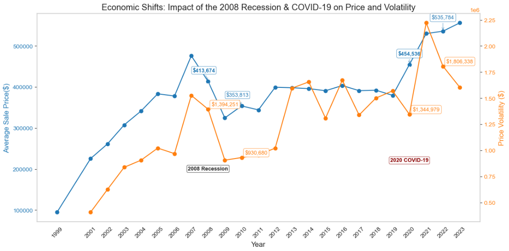
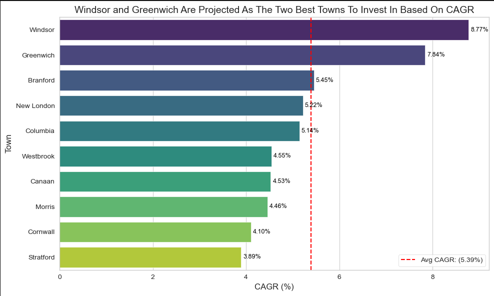

# 25 Years of CT Real Estate: Timing, Risk, and Town-Level Strategy

## Table of Contents
- [Project Overview](#project-overview)
- [Tools & Techniques](#tools--techniques)
- [Insights](#insights)
  - [Seasonal Trends](#seasonal-trends)
  - [Residential Type Volatility](#residential-type-volatility)
  - [Economic Shifts & Market Resilience](#economic-shifts--market-resilience)
  - [Opportunistic Investments](#opportunistic-investments)
- [Recommendations](#recommendations)
- [Data Limitations](#data-limitations)

---

## Project Overview
This project analyzes over **1 million Connecticut property sales from 1999 to 2023** to uncover strategic insights for real estate investment. Using financial and statistical methods like **CAGR, volatility analysis, and time series trends**, it identifies where, when, and what to invest in for optimal returns.

**Key Insights:**
- **Best Buy Season:** Winter months (Jan–Feb) offer **20–30% lower median prices** than peak summer
- **Property Risk Profile:** **Condos have 40.5% higher volatility** than single-family homes — suitable for risk-tolerant investors
- **Top Growth Towns:** Windsor and Greenwich outperformed state averages with **CAGR of 7-9%**
- **Economic Resilience:** Prices dropped significantly during 2008 and COVID-19 but rebounded within 24 months

---

## Tools & Techniques
- **Python (Pandas, NumPy, Matplotlib):** Time series analysis, CAGR & volatility calculations, town segmentation
- **Excel:** Data cleaning, validation, pivot table summaries

**Metrics Used:**
- **CAGR** — long-term town-level growth
- **Price Volatility** — risk segmentation by property type
- **Monthly Trend Analysis** — seasonality-driven timing
- **Economic Event Analysis** — shifts during 2008 & COVID-19

---

# Insights

## Seasonal Trends
- **Home prices peak in summer:** June through August show the highest median sale prices, exceeding winter lows by 12% (~$25K difference).
- **Winter = lower entry point, less competition:** January and February offer the lowest prices and less buyer traffic, ideal for investors entering undervalued markets.
- **Sales volume also peaks in summer:** Suggesting more liquidity but also higher competition.

**Investing Takeaway:** Buying during winter months can reduce acquisition costs by ~$25K, giving investors more room for renovation budgets, yield margins, or faster equity growth.

### Monthly Investment Opportunity Matrix
This bubble chart maps each month by:
- Median Sale Price (x-axis)
- Number of Sales (y-axis)
- Total Market Volume (bubble size)

Dashed lines show average values, creating four zones of investment strategy.

**Top-Left: Best Value Zone**  
Months like October and December combine **high sales volume with below-average prices** — great for investors who want active markets without overpaying.

**Bottom-Left: Bargain Zone**  
**January, February, and March offer the lowest prices**, but with fewer transactions. These are ideal for patient, value-driven investors willing to trade liquidity for deep discounts.

**Top-Right: Peak Season**  
**June through August** are the hottest months — **high demand, high volume, but also high prices**. Great for sellers or volume-driven strategies, less ideal for value-focused buyers.

**Investing Takeaway:** The best investment timing often falls outside of peak season. October and December offer strong opportunity with balanced price and activity, while February and January provide the steepest discounts for risk-tolerant investors.

### Investment Score – How It Works
The Investment Score helps identify which months offer the most favorable conditions for real estate investment by blending three key factors:

**Components:**
- **Price Score:** Lower median sale prices are more attractive to investors — scaled so that cheaper months score higher.
- **Volume Score:** Fewer transactions may signal less competition — scaled so that lower-volume months score higher.
- **Market Opportunity Score:** Measures total transaction volume ($) — indicates where there’s active buyer/seller interest.

**Weights Used:**
- Price Score: 30%
- Volume Score: 40%
- Market Opportunity Score: 30%

These weights reflect an investor strategy that values timing and opportunity, balancing entry cost, market liquidity, and competition.

**Final Score:**  
Each score is normalized using MinMaxScaler, then combined into a single metric:

**Investment Score = (0.3 × Price Score) + (0.4 × Volume Score) + (0.3 × Market Opportunity Score)**

**Why It Matters:**  
This score enables a data-driven comparison across months, helping investors:
- Avoid overpriced periods (e.g., peak summer)
- Enter during lower-competition windows
- Focus on months with strong market activity

**Investing Takeaway:** The best time to invest isn’t when the market is hottest — it’s when prices are cold and competition is low. Target January to March for the highest value opportunities.

---

## Residential Type Volatility
- **Condos are 40.5% more volatile than single-family homes** (Std. Dev: $1.18M vs $703K), offering high upside potential, ideal for risk-tolerant investors seeking short-term returns.
- **Single-family homes offer the most price stability**, making them better suited for conservative, long-term investment strategies.
- **Despite their volatility, condos top our Combined Investment Score**, driven by strong long-term growth (CAGR) and high transaction activity.

### How the Combined Score Works
To rank property types, the following metrics were calculated:
- **CAGR (%)**: Long-term annual price growth
- **Price Score**: Inverse of median price (lower prices = better entry point)
- **Volume Score**: Inverse of sales volume (lower volume = less competition)
- **Market Opportunity Score**: Based on total sales activity

Each metric was scaled, and the final score was weighted as listed below:  
**Combined Score = 60% CAGR + 40% Average Price/Opportunity Score**

**Investing Takeaway:** Choose based on risk tolerance — condos offer high-growth, high-risk potential, while single-family homes provide more predictable returns and long-term security.

---

## Economic Shifts & Market Resilience
This chart captures the real impact of economic downturns on Connecticut’s housing market — showing how both average sale prices and volatility responded to the 2008 financial crisis and the COVID-19 pandemic.

### What the Data Shows

**2008 Recession**
- Prices dropped ~$60K (–14.5%) from 2008 to 2010.
- Volatility cratered from $1.39M → $930K, reflecting frozen demand and investor hesitation.

**COVID-19 Shock (2020)**
- Prices initially dipped, but surged +18% in just 2 years — the fastest rebound in two decades.
- Volatility exploded past $2.2M, marking the most chaotic year on record before stabilizing.

**What This Means for Investors:**  
Economic shocks don’t collapse the market — they bend it, briefly. Each crisis created a window where prices dropped and volatility spiked, only to recover, or accelerate, shortly after.

**Investing Takeaway:**  
The best time to buy isn’t after a rebound — it’s during the chaos. History shows that smart investors capitalize on fear, entering the market when others pull back.

---

## Opportunistic Investments
This section identifies the top-performing towns in Connecticut based on the **Compound Annual Growth Rate (CAGR)** of average home sale prices from 1999 to 2023.

### What is CAGR?
- **CAGR (Compound Annual Growth Rate)** measures the average yearly growth rate of an investment over time, assuming steady, compounding returns.
- **Formula:** `((End Value / Start Value) ^ (1 / Years)) – 1`

### Key Findings
- **Windsor (8.77%) and Greenwich (7.84%)** outperformed all other towns — nearly 60% higher than the state average CAGR of 5.39%.
- Other consistent growers include **Branford, New London, and Columbia**, all posting over 5% CAGR.
- These towns aren’t just growing — **they’re compounding**. Their price appreciation has been steady, long-term, and resilient across market cycles.

### Why These Towns?
Windsor and Greenwich benefit from **proximity to major employment hubs (Hartford & NYC)**, **strong household incomes**, and **ongoing residential and economic development**. These fundamentals support sustained price growth and investment demand.

**Investor Takeaway:**  
The best growth isn’t always in the biggest cities. Target emerging towns with strong fundamentals and long-term price momentum — like Windsor and Greenwich — to maximize ROI and build equity faster.

---

## Recommendations
- **For Value Buyers:** Purchase between January and March to save ~$25K on median pricing.
- **For Long-Term Investors:** Focus on towns with 20+ year CAGR > 7% like Windsor and Greenwich.
- **For Risk-Tolerant Investors:** Condos carry higher price volatility but may yield higher returns if paired with stable assets.
- **For Market-Timers:** Downturn years like 2008 and 2020 show that short-term dips are buying windows, not red flags.

---

## Data Limitations
- **Data ends in 2023:** Recent market shifts and interest rate impacts are not captured.
- **No rental yield data:** Limits ability to evaluate income-producing potential.
- **No macroeconomic variables included:** Mortgage rates, inflation, and employment data are excluded.
- **Rural data inconsistencies:** Some small towns had incomplete or irregular sales reporting.
- **This is a price-based historical analysis:** Trends are not adjusted for property condition, renovation status, or policy changes.

---

To view the full Python analysis, [click here.](https://github.com/amontaywelch/Connecticut_Real_Estate_Analysis/blob/main/CT_real_estate.ipynb)
Check out my [LinkedIn!](https://www.linkedin.com/in/amontaywelch/)
