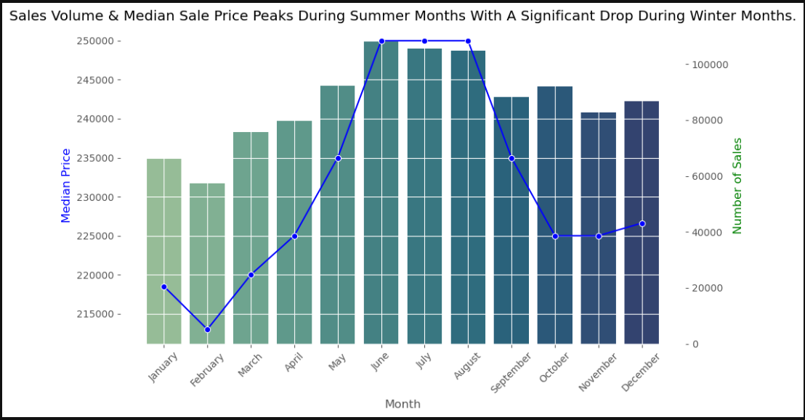
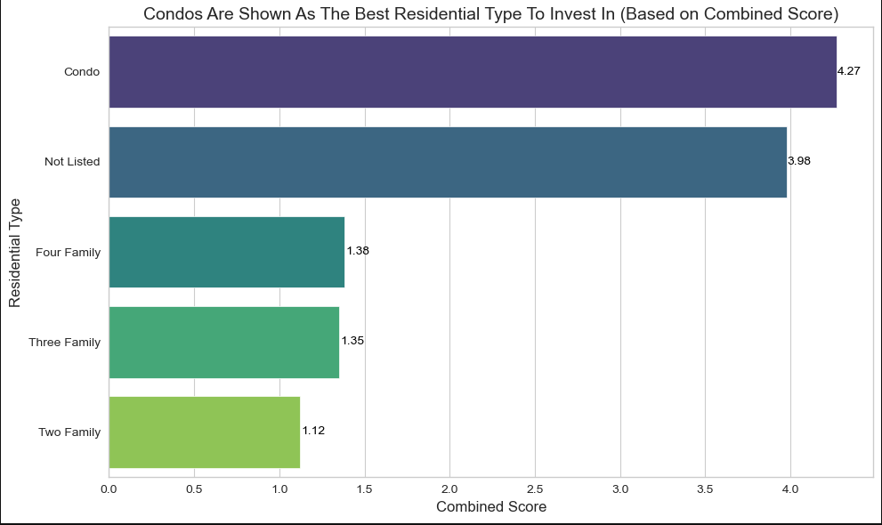
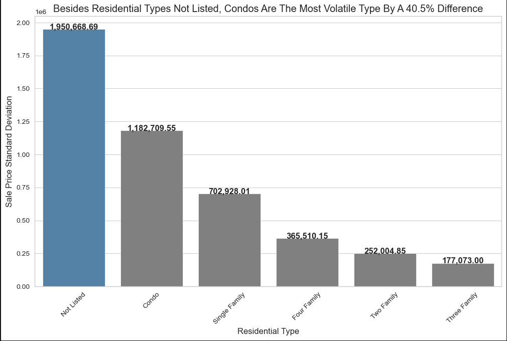
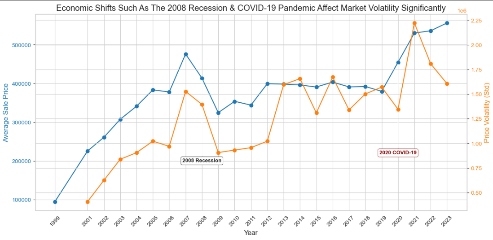
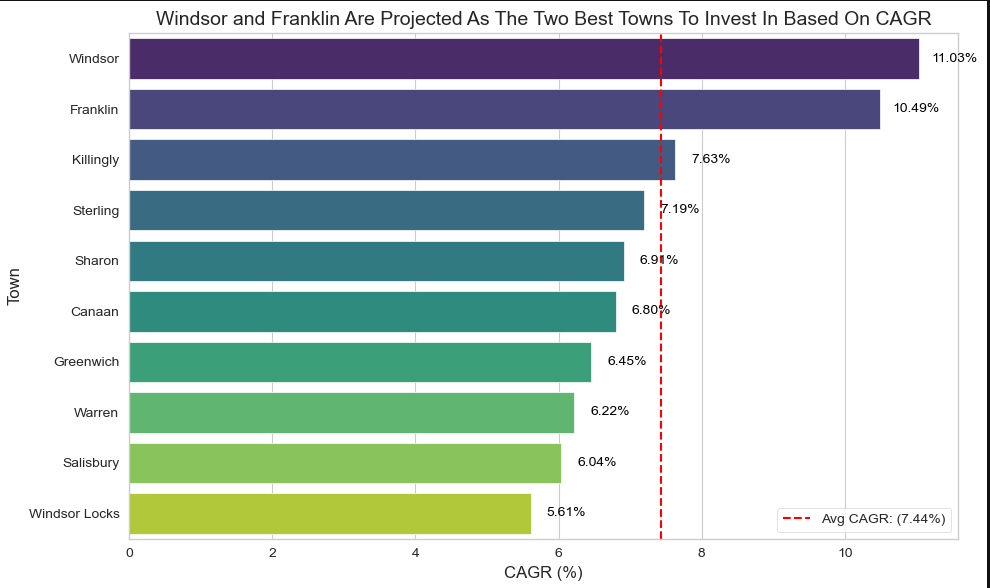

# 25 Years of CT Real Estate: Timing, Risk, and Town-Level Strategy

## Table of Contents
- [Project Overview](#project-overview)
- [Tools & Techniques](#tools--techniques)
- [Insights](#insights)
  - [Seasonal Trends](#seasonal-trends)
  - [Residential Type Volatility](#residential-type-volatility)
  - [Economic Shifts](#economic-shifts)
  - [Opportunistic Investments](#opportunistic-investments)
- [Recommendations](#recommendations)
- [Data Limitations](#data-limitations)

---

##  Project Overview
This project analyzes over **1 million Connecticut property sales from 1999 to 2023** to uncover strategic insights for real estate investment. Using financial and statistical methods like **CAGR, volatility analysis, and time series trends**, it identifies where, when, and what to invest in for optimal returns.

**Key Insights:**
- **Best Buy Season:** Winter months (Jan–Feb) offer **20–30% lower median prices** than peak summer
- **Property Risk Profile:** **Condos have 40.5% higher volatility** than single-family homes — suitable for risk-tolerant investors
- **Top Growth Towns:** Windsor and Franklin outperformed state averages with **CAGR of 9–11%**
- **Economic Resilience:** Prices dropped significantly during 2008 and COVID-19 but rebounded within 24 months

---

##  Tools & Techniques
- **Python (Pandas, NumPy, Matplotlib):** Time series analysis, CAGR & volatility calculations, town segmentation
- **Excel:** Data cleaning, validation, pivot table summaries
- **Metrics Used:**
  - **CAGR** — long-term town-level growth
  - **Price Volatility** — risk segmentation by property type
  - **Monthly Trend Analysis** — seasonality-driven timing
  - **Economic Event Analysis** — shifts during 2008 & COVID-19

---

##  Insights

###  Seasonal Trends
- **Home prices peak in summer**: June through August show the highest median sale prices, exceeding winter lows by 12% ($25K difference).
- **Winter = lower entry point, less competition**: January and February offer the lowest prices and less buyer traffic, ideal for investors entering undervalued markets.
- **Sales volume also peaks in summer**: Suggesting more liquidity but also higher competition.

**Investing Takeaway**: Buying during winter months can reduce acquisition costs by ~$25K, giving investors more room for renovation budgets, yield margins, or faster equity growth. 

###  Residential Type Volatility
- **Condos are 68% more volatile than single-family homes** (Std. Dev: $1.18M vs $703K), offering high upside potential, ideal for risk-tolerant investors seeking short-term returns.
- **Single-family homes offer the most price stability**, making them better suited for conservative, long-term investment strategies.
- **Despite their volatility, condos top our Combined Investment Score**, driven by strong long-term growth (CAGR) and high transaction activity.

### How the Combined Score Works
To rank property types, the following metrics were calculated:
 - **CAGR (%)**: Long-term annual price growth
 - **Price Score**: Inverse of median price (lower prices = better entry point)
 - **Volume Score**: Inverse of sales volume (lower volume = less competition)
 - **Market Opportunity Score**: Based on total sales activity
 - Each metric was scaled, and the final score was weighted as listed below: 
 - Combined Score = 60% CAGR + 40% Average Price/Opportunity Score

**Investing Takeaway**: Choose based on risk tolerance — condos offer high-growth, high-risk potential, while single-family homes provide more predictable returns and long-term security.

  

###  Economic Shifts
- **Market dips during 2008 and COVID-19 were sharp but short-lived**, with median prices rebounding within 12–24 months.
- **Historical resilience suggests downturns are buying opportunities**, not permanent losses.

###  Opportunistic Investments
- **Windsor and Franklin posted 10.5–11% annual growth** over two decades, more than triple the state median.
- **Smaller towns consistently outperformed urban centers**, offering higher ROI with less competition and market saturation.

---

##  Recommendations
- **Time Your Purchases**: Target January-March to capture median price discounts of ~12%.
- **Balance Your Portfolio**: Mix volatile assets(condos) with stable assets(single-family homes) to manage risk. 
- **Invest In High-Growth Towns**: Focus on Windsor, Franklin, and similar emerging markets with strong long-term trends.
- **Buy The Dip, Strategically**: Economic downturns like 2008 and 2020 created short-term slumps — but long-term growth remained intact.

---

##  Data Limitations
- Data ends at 2023; recent market shifts not captured
- No inclusion of mortgage rates, rental yield, or macroeconomic overlays
- Some rural town records had missing values or inconsistencies

---
---

To view the full Python analysis, [click here.](https://github.com/amontaywelch/ct_real_estate/blob/main/CTrealestate%20(2).ipynb)
Check out my [LinkedIn!](https://www.linkedin.com/in/amontaywelch/)
